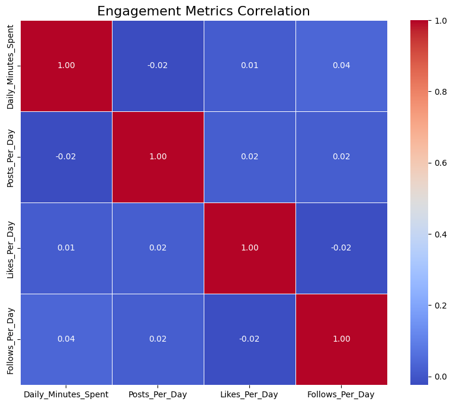

# Social Media Engagement Analysis

## 🔍 Project Overview
Analysis of 7,000 social media usage records reveals surprising patterns in user behavior across Facebook, Instagram, Twitter, Snapchat, TikTok, LinkedIn, and Pinterest. This project uncovers unexpected relationships between platform usage and engagement metrics.

## 📊 Key Insights
1. ⏱️ **Instagram Dominates Attention**: Users spend a staggering average of **278 minutes/day** - over 4.5 hours daily!
2. 📸 **Instagram Content Creation Hub**: Users post **12 times/day** on average, making it the most active platform
3. 👍 **Facebook Leads Engagement**: Despite lower posting frequency, Facebook generates **102 likes/day** per user
4. 🔄 **Engagement Paradox**: Time spent shows near-zero correlation with likes received (r=0.01), challenging conventional wisdom

## 📈 Counterintuitive Findings
- **No engagement payoff for time invested**: More screen time doesn't translate to more likes
- **Instagram's double burden**: Highest posting frequency AND longest usage, but not top engagement platform
- **Facebook efficiency**: Generates most engagement with less user time investment

## 💡 Business Implications
1. **Content Quality > Screen Time**: Focus on compelling content rather than encouraging longer sessions
2. **Instagram Optimization**: Reduce friction in content creation to maintain high posting frequency
3. **Facebook Value Proposition**: Highlight its engagement efficiency to attract content creators
4. **Re-examine Algorithms**: Investigate why time spent doesn't correlate with engagement rewards
## 📂 Repository Structure

social-media-analysis/
├── data/ # Original datasets
├── notebooks/ # Analysis notebook
├── visualizations/ # Generated charts
├── .gitignore
├── requirements.txt
└── README.md

## 🛠️ How to Run
1. Clone repository
2. Install dependencies: `pip install -r requirements.txt`
3. Run `Social_Media_Analysis.ipynb` in Jupyter

## 📝 Methodology
Data Consolidation: Combined 7 platform-specific datasets

Robust Metrics: Used medians to handle outliers in social media metrics

Engagement Analysis: Compared posting vs engagement efficiency

Correlation Testing: Calculated Pearson coefficients between key metrics

## 🔍 Surprising Visualizations

## Time vs Engagement Disconnect

[Correlation matrix](https://github.com/TawanaShava/Social-Media-Engagement-Analysis/blob/main/visualizations/correlation_matrix.png)

**Near-zero correlation between time spent and likes challenges assumptions**

## Platform Engagement Comparison

[Engagement comparison](https://github.com/TawanaShava/Social-Media-Engagement-Analysis/blob/main/visualizations/engagement_comparison.png)
**Facebook leads in likes despite lower posting frequency** 

## Daily Time Commitment

[Time spent](https://github.com/TawanaShava/Social-Media-Engagement-Analysis/blob/main/visualizations/time_spent.png)
**Instagram users spend 4.5+ hours daily on the platform**
